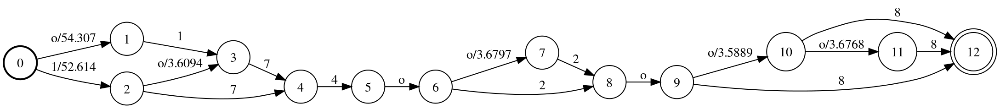
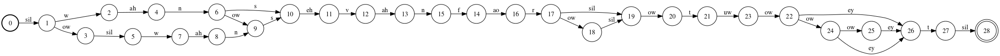

####Controlled remote vs local excution: `cmd.sh`
Kaldi is designed to work with SunGrid clusters.
It also work with other clusters.
We want to run it locally, it can do that too.
This can be done by making sure cmd.sh sets the variables as follows:

```
export train_cmd=run.pl
export decode_cmd=run.pl
```
rather than making references to `queue.pl`.


#Training/Evaluating Recogniser

The majority of what is done covered by this page, 
is triggered by the script `run.sh`


## Feature Extraction

###Extracting the MFCC Features
See [this section of the kaldi tuitorial](http://kaldi.sourceforge.net/tutorial_running.html#tutorial_running_feats)

[Mel-frequency cepstral coefficient](http://en.wikipedia.org/wiki/Mel-frequency_cepstrum)  (MFCCs) features.
Done using the script `steps/make_mfcc.sh`

####Compute Cepstral Mean and Variance Normalization statistics
Done using the script `steps/compute_cmvn_stats.sh`

##Training
Done using the script `steps/train_mono.sh`, However very similar steps are used in the other training scripts from in `steps` (such as `steps/train_deltas`).

Usage:

```
steps/train_mono.sh [options] <training-data-dir> <lang-dir> <exp-dir>"
```
 - `training-data-dir` is the path to the training data directory [prepaired earlier](./data_prep)
 - `lang-dir` is the path the the directory containing all the language model files, [also prepared earlier](./lang_prep)
 - `exp-dir` is a path for the training to store all of its outputs. It will be created if it does not exist.

###Configuration / Options 
The `train_mono` script takes many configuration options.
They can be set by passing them as flags to script: as so: `--<option-name> <value>`.
Or by putting them all into a config bash script, and adding the flag `--config <path>`.
THey could also be set by editting the defaults in `steps/train_mono.sh`, but there is no good reason to do this.


 * `nj`: Number of Jobs to run in parrellel. (default `4`) 
 * `cmd`:  Job dispatcher script  (default `run.pl`)
 * `scale_opts`: takes a string (wrap it in quotes) to control scaling options (default `"--transition-scale=1.0 --acoustic-scale=0.1 --self-loop-scale=0.1"`)
 	* `transition-scale` (default `1.0`)
	* `acoustic-scale` (default `0.1`)
	* `self-loop-scale` (default `0.1`)
 * `num_iters` Number of iterations of training (default `40`)
 * `max_iter_inc`  Last iter to increase number of Gaussians on (default `30`)
 * `totgauss` Target number of Gaussians (detault `1000`)
 *  `careful` passed on to gmm-align-compiled. To quote its documention: "If true, do 'careful' alignment, which is better at detecting alignment failure (involves loop to start of decoding graph)." (default `false`)
 * `boost_silence` Factor by which to boost silence likelihoods in alignment. (Default `1.0`)
 *  `realign_iters` iterations in which to perform realignment (default `"1 2 3 4 5 6 7 8 9 10 12 14 16 18 20 23 26 29 32 35 38"`)
 * `power`  exponent to determine number of gaussians from occurrence counts (detault `0.25`)
 * `cmvn_opts`  options will be passed on to cmvn -- like scale_opts. (default `""`)
 * `stage`: This is used to allow you to skip some steps, if the program crashed partway though. The stage variable sets the stage to start at. The stages are discussed in the next section (default `-4`)

### Initialisation Stages

####Initialise GMM (Stage -3)
Uses `/kaldi-trunk/src/gmmbin/gmm-init-mono`.
Call that with the `--help` option for more info

This defines (amoung other things), how many GMMs there are initially.


####Compile Training Graphs (Stage -2)
uses `/kaldi-trunk/source/bin/compile-training-graphs`.
Call that with the `--help` option for more info.

See [this section of the documentation](http://kaldi.sourceforge.net/graph_recipe_train.html).

####Align Data Equally (Stage -1)
Creates an equally spaced alignment. As a starting point for further alignment stages.
Uses `/kaldi-trunk/source/bin/align-equal-compiled`.
Call that with the `--help` option for more info.

####Estimate Gaussians (Stage 0)
Do the  maximum likelihood estimation of GMM-based acoustic model.
Uses `/kaldi-trunk/src/gmmbin/gmm-est`.
Call that with the `--help` option for more info. 

The script notes:
>In the following steps, the `--min-gaussian-occupancy=3` option is important, otherwise
> we fail to est[imate] "rare" phones and later on, they never align properly.


###Training (Stage = Iterations completed)
Every Iteration a number of steps are carried out.

####Realign
If this iteration is one of the `realign_iters` then:

#####Boost Silence
Silence is boosted using `/kaldi-trunk/src/gmmbin/gmm-boost-silence`,
Call that with the `--help` option for more info.
Notably it does not nesc boost the silence phone (but it does in this training case), it can boost any phone.
It does this by modifying the GMM weights, to make silence more probable.

#####Align 
Features are aligned given the GMM models.
Uses `kaldi-kaldi/src/gmmbin/gmm-align-compiled`.
Call that with the `--help` option for more info.

###Reestimate the GMM model.
First accumulate stats which are used in the next step.
This is done using `/kaldi-trunk/src/gmmbin/gmm-acc-states-ali`.
Call that with the `--help` option for more info.

Then redo the GMM-based acoustic model.
This is done with  `/kaldi-trunk/src/gmmbin/gmm-est`, but using very different arguments.
Again call that with the `--help` option for more info.


Finally, increase the number of Gaussians (capped by `max_iter_inc`), so that by the time all the iterations (`num_iters`) are all complete, it will approach the target total number of gaussians (`totgauss`) -- assuming `max_iter_inc` did not block it.


##Making of the Graph

As showing earlier, the Grammer (G) can be composed with the Lexicon (L),
to get a phoneme to word mapping.

To increase the power of the phones, they could be expanded to add context.
For example making the 'ay' phone in 'n-ay-n' (nine) different from the one in 'm-ay-n' (mine).
This can be done with a Contrext dependancy FST, which can be scaled
with the number of phones to take into account in the context.
This is roughly equivelent to making use of n-grams on the phonetic level. Using 3 (ie one ot each side) context is refered to a triphones.

The Context Dependency can be expressed as a FST, refered to as C.


[This blog post](http://vpanayotov.blogspot.com.au/2012/06/kaldi-decoding-graph-construction.html) presents the details of the creation quiet well. It will be a bit of revision from the data preparation step.


###Usage of `util/mkgraph.sh`
The final graph is created using `util/mkgraph.sh`
To quote the introduction to that script:
> ...creates a fully expanded decoding graph (HCLG) that represents
> all the language-model, pronunciation dictionary (lexicon), context-dependency,
> and HMM structure in our model.  The output is a Finite State Transducer
> that has word-ids on the output, and pdf-ids on the input (these are indexes
> that resolve to Gaussian Mixture Models).

It also creates the afformentioned Context Dependency Graph.

Usage: 

```
utils/mkgraph.sh [options] <lang-dir> <model-dir> <graphdir>
```

 - `lang-dir` is, as before, the path the the directory containing all the language model files, [also prepared earlier](./lang_prep)
 - `model-dir` is the `exp-dir` from the previous train-mono step, which now contained the trained model.
 - `graph-dir` is the directory to place the final graph in. In the example script this is made as a graph subdirectory under the `exp-dir`. If it does not exist, it will be created

 - 

####Context Options
There are 3 options for defing how many phones are used to create the context.
theres are pathsed as the options to the `utils/mkgraph.sh` script

 - ` --mono` for monophone ie one phone ie no context (Used in `steps/train_mono.sh`)
 - no flag (default) for triphone ie 3 phones ie one phone ot each side for context
 - `--quinphone` for quinphone ie 5 phones ie 2 phones to each side for context

It would not be hard to extend the mkgraph script to create contexts of any length.
The section of the mkgraph script responsible for this,
makes use of `/kaldi-trunk/src/fstbin/fstcomposecontext`, take a look at its `--help` for more information.


##Decoding

Decoding of th Graph is done using `steps/decode.sh`.
This script only works only for certain feature types -- conviently all the feature types we use in TIDIGITS. (Similar decoding functions also exist in steps, for other feature types)

###Usage for `steps/decode.sh`

Usage:
```
steps/decode.sh [options] <graph-dir> <test-data-dir> <decode-dir>
```

 - `test-data-dir` is the path to the training data directory [prepaired earlier](./data_prep)
 - `graph-dir` is the path the the directory containing the graphs generated in the previous step
 - `decode-dir` is a path to store all of its outputs -- including the results of the evaluations. It will be created if it does not exist.

###Configuration / Options 
The `decode.sh` script takes many configuration options, these should be familar from the `train_mono.sh` script options above.
They can be set by passing them as flags to script: as so: `--<option-name> <value>`.
Or by putting them all into a config bash script, and adding the flag `--config <path>`.
They could also be set by editting the defaults in `steps/decode.sh`, but there is no good reason to do this.


 * `nj`: Number of Jobs to run in parrellel. (default `4`) 
 * `cmd`:  Job dispatcher script  (default `run.pl`)


 * `iter`: Iteration of model to test. Training step above actually stores a copy of the model for each iteration. This option can be used to go back and test that (default final trained model). Overridden by `model` option.
 * `model`: which model to use, given by path. If given this overides the `iter` (default determined by valure of `iter`)
 
 * `transform-dir` directory path to find fMLLR transforms (Not useful for TIDIGITS). (default: N/A only used if fMLLR transformed were done on features.)
 * `scoring-opts` options to local/score.sh. Can be used to set min and max Language Model Weight for rescoring to be done. (default: "")
 * `num-threads` number of threads to use, (default 1).
 *  --parallel-opts <opts>                           # e.g. '-pe smp 4' if you supply --num-threads 4
 * `stage`: This is used to allow you to skip some steps, as above. However decode only has 2 stages. If stage is greater than 0 will skip decoding and just do scoring. (default `0`)

Options passed on to `kaldi-trunk/src/gmmbin/gmm-latgen-faster`:

 * `acwt` acoustic scale applied to accoustic likelyhoods applied in lattice generation (default 0.083333). It affects the pruning of the latice (low enough likelyhood will be pruned).
 * `max_active` (default 7000)
 * `beam` decoding beam (default 13.0)
 * `lattice_beam` latice generation beam (default 6.0)


###Lattices
From the [Kaldi documentation]( http://kaldi.sourceforge.net/lattices.html) "A lattice is a representation of the alternative word-sequences that are "sufficiently likely" for a particular utterance."

[This blog post](http://codingandlearning.blogspot.com.au/search/label/KWS14) gives an introduction to the Latices in Kaldi quiet well, relating them to the other FSTs.

Kaldi creates and uses these latices during the decoding step.
However, interpretting them can be hard, because all the commandline programs for working with them use [Kaldi's special table IO](http://kaldi.sourceforge.net/io_tut.html), describing how this works in detail is beyound the scope of this introduction.
The commandline programs in question can be found in `/kaldi-trunk/src/latbibin`


The Latices are output during the decoding into `<decode-dir>`. Into a numbered gzipped file. eg `lat.10.gz`. Don't bother unzipping them -- the internal files are binary also.
Each of these archieves containes many latices - one for each utterance.

Commands to work with them take the general form of:

```
<latice-command> [options] "ark:gunzip -c <path to lat.N.gz>|" ark,t:<outputpath>

```
Each of the latice commands do take the `--help` option which will cause them to give the other options.

####Example Conveting a latice to a FST Diagram
For example,
Consider the lattice gzipped at `exp/mono0a/decode/lat.1.gz`

Running:

```
lattice-to-fst "ark:gunzip -c exp/mono0a/decode/lat.1.gz|" ark,t:1.fsts
utils/int2sym.pl -f 3 data/lang/words.txt 1.fsts > 1.txt.fsts

```

(Assuming that `/kaldi-trunk/src/latbin` is in your path)

Will fill `1.fsts` with a collection of text form fsts, one for each utterance space seperated.
Ones with multiple terminal states have multiple different "reasonably likely" phrases possible.
The output labels on the transitions are words (Which we restored using int2sym).
The weights are the negitive log likelyhood of that transitor (or that final state)

As shown below:

```
ad_16a 
0 1 1 3 14.7788 
1 2 6 8 5.0416 
2 2.61209 

ad_174o2o8a 
0 1 1 3 12.5118 
0 11 o 2 9.44585 
1 2 7 9 9.34774 
1 16 o 2 6.57278 
2 3 4 6 2.08985 
3 4 o 2 10.2191 
4 5 2 4 4.91992 
4 9 o 2 3.20784 
5 6 o 2 3.84306 
6 7 o 2 3.90951 
6 13 8 10 7.07031 
7 8 8 10 6.74935 
7 14 o 2 3.79537 
8 2.61209 
9 10 2 4 5.3914 
10 6 o 2 3.84306 
11 12 1 3 4.75861 
12 2 7 9 9.34774 
13 2.61209 
14 15 8 10 6.63099 
15 2.61209 
16 17 7 9 6.38392 
17 3 4 6 2.08985 
```

Then we grab one particular FST off of it. (in this case just  using Awk to grab some lines -- most sophisticated approaches exist). Compile it. 
Project it only along the input labels (cos they are the words it will guess at), Minimise the number of states to get a simpler but equivelent model (easier to read) and finally draw it as an FSA.

```
cat 1.txt.fsts | awk "6<NR && NR<30" |\
    fstcompile --isymbols=data/lang/words.txt --keep_isymbols| \ 
    fstproject | fstminimize| \ 
    fstdraw --portrait --acceptor | dot -Tsvg > 1.2.svg
```

The Result of this, being a FSA that will accept (/generate) the likely matchs for the utterance `ad_174o2o8a`. 
The utterance actually said "174o2o8", wich is accepted by the path through states "0,2,4,5,6,8,9,12"

Note: that when the confidance in the path being correct is very high no weight is shown.



Notice that the latice has alot of paths allowing 'o' to be followed by another 'o'.

#### Drawing Phone Lattices
Much like we can draw lattices at the word level,
we can go down to draw them at the phone level.


```
lattice-to-phone-lattice exp/mono0a/final.mdl "ark:gunzip -c exp/mono0a/decode/lat.1.gz|" ark,t:1.ph.lats
lattice-copy --write-compact=false ark:1.ph.lats ark,t:1.ph.fsts
utils/int2sym.pl -f 4 data/lang/phones.txt 1.ph.fsts > 1.ph.txt.wfsts
cat 1.ph.txt.wfsts | awk 'BEGIN{FS = " "}{ if (NF>=4) {print $1," ", $2," ",$3," ",$4;} else {print $1;};}' > 1.ph.txt.fsts
```

Notice that in the first step the model (final.mdl)  was also used.
The output of the first step is in the Compact Latice form which is not ammniable to being worked with by scripts like int2sym.
The secondset expands it, making it a FST.
Third step is simply subsituting the phone symbols into the output. It is worth looking perhaps at 1.ph.txt.fsts, notices that the weights are only at start word phones. It is also however hard to read as it have hundred of empty string states ('<eps>'). Notice also there are 2 weights (this is the Graph Weight and the Accustic Weight). 
As there are 2 weights, this is not in a valid format for OpenFST. Thus the four line (the Awk Script) removed them all.

With that done we now have something that looks like a collection txt.fst, however it is still increbly willed with epsilon states.

Now to draw it up. Capturing the utterance `ad_174o2o8a` again, we will draw it:

```
cat 1.ph.txt.fsts| awk "199<NR && NR<1246" | \
    fstcompile --osymbols=data/lang/phones.txt --keep_osymbols | \
    fstproject --project_output | \
    fstrmepsilon | fstdeterminize | fstminimize  | \
    fstdraw --portrait --acceptor | dot -Tsvg > 1.ph.svg
```

So the steps being again, grabing the lines we want, compling it.
Projecting it (this time on the output space),
removing espilons, determining, and minimising to make it more readable.
Then drawing it.

(Click to view full screen image)
[](./174o2o8aPhones.png)


Viewing Results
Also during te decoding step the results are recorded.

The  can be found in `<decode-dir>` under filenames called  `wer_<N>` where `N` is a number

Example:

```
compute-wer --text --mode=present ark:data/test/text ark,p:-
%WER 1.63 [ 670 / 41220, 420 ins, 111 del, 139 sub ]
%SER 4.70 [ 590 / 12547 ]
Scored 12547 sentences, 0 not present in hyp.
```

The wikipedia entry on [Word Error Rate (WER)](https://en.wikipedia.org/wiki/Word_error_rate), is a reasonable introduction, if you are not familar with it.

The Sentence Error Rate (SER), is actually the utterance error rate.
Of all the unterances in the test set, it is the portion that had zero errors.
Both error rates only consider the most likely hypothesis in the latice.

